# Laravel Nova Media Field (WIP)

**Laravel Nova Media Field** is a component designed to integrate seamlessly with Spatie's Media Library, allowing for efficient media file management within Laravel Nova. This package makes it easy to upload, list, and edit media files directly from your Nova dashboard.

## Features:
- Easy media file upload
- Previews and edits
- Comprehensive media management

This component enhances the media management experience in Nova, offering a simple yet customizable solution for developers.

## Install

```bash
composer require ferdiunal/laravel-nova-media-field
```

## Usage

```php
/**
 * Get the fields displayed by the resource.
 *
 * @return array
 */
public function fields(NovaRequest $request)
{
    return [
        ID::make()->sortable(),
        MediaField::make('Logo', 'logo')
          ->required()
          ->multiple()
          ->vapor()
          ->withResponsive()
          ->validate(
                minSize: 30, // The allowed extensions for the file.
                maxSize: 1024 * 50, // The allowed mime types for the file.
                size: 1024 * 50, // The minimum size of the file.
                image: false, // The maximum size of the file.
                video: false, // The size of the file.
                audio: false, // Whether to allow only image files.
                document: false, // Whether to allow only video files.
                pdf: false, // Whether to allow only audio files.
                txt: false, // Whether to allow only document files.
                json: false, // Whether to allow only PDF files.
                csv: false, // Whether to allow only text files.
                xlsx: false, // Whether to allow only JSON files.
                docx: false, // Whether to allow only CSV files.
                creation: false, // Whether to allow only XLSX files.
                update: false, // Whether to allow only DOCX files.
                default: false, // Whether to apply the rules for creation.
                allowedExtensions: [], // Whether to apply the rules for update.
                allowedMimeTypes: [] // Whether to apply the rules as default.
            )
    ];
}

```

## Screenshots

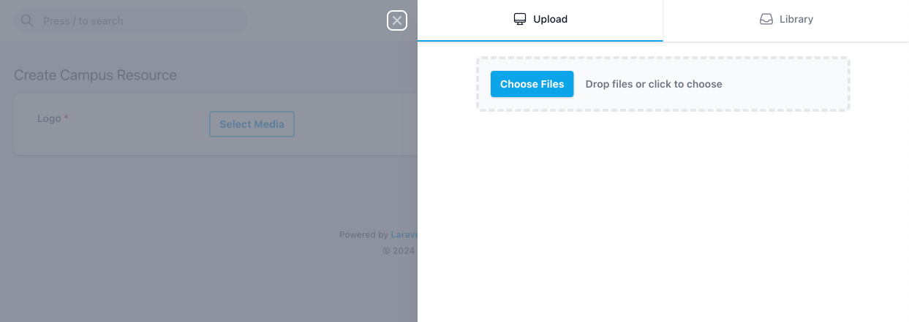
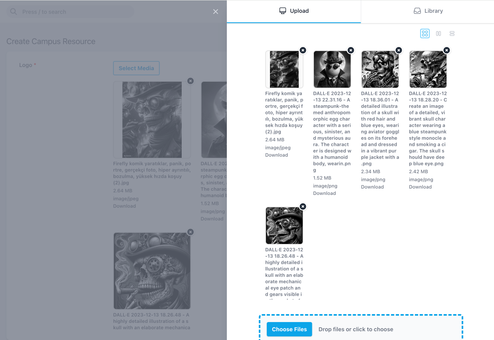
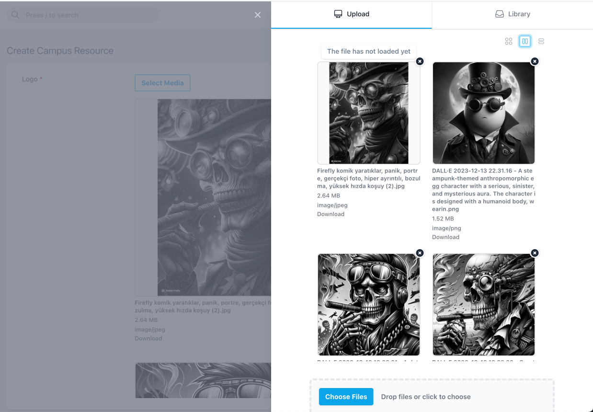

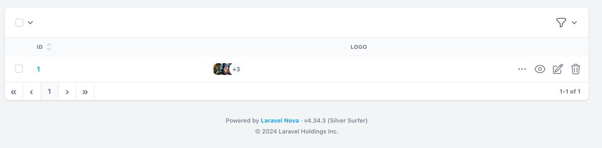
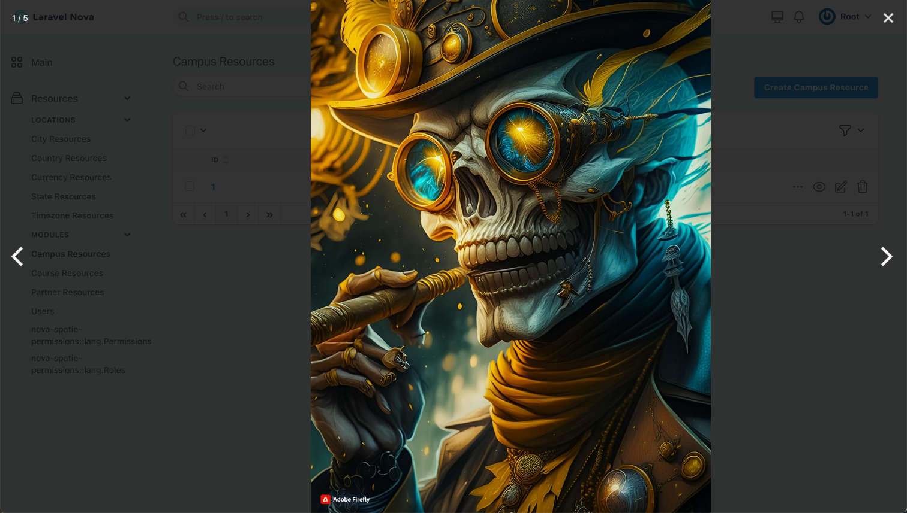
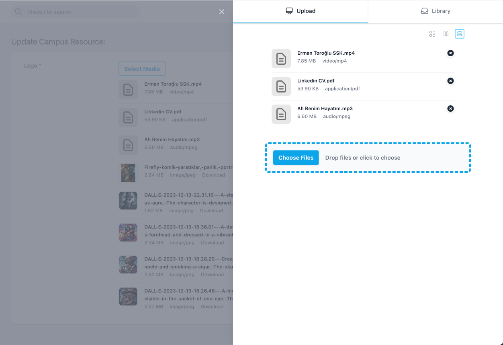

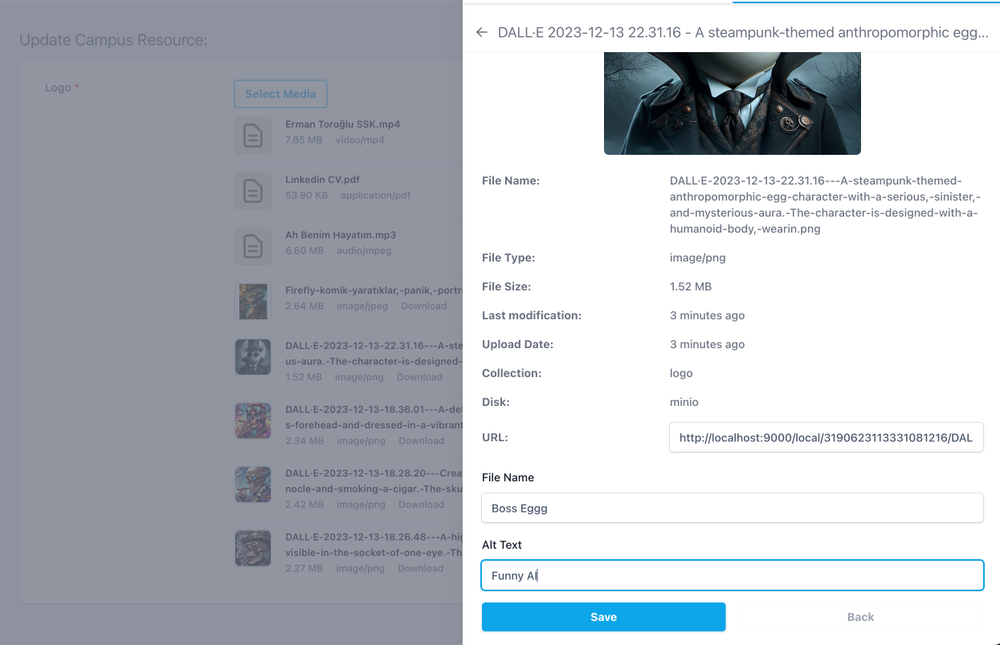
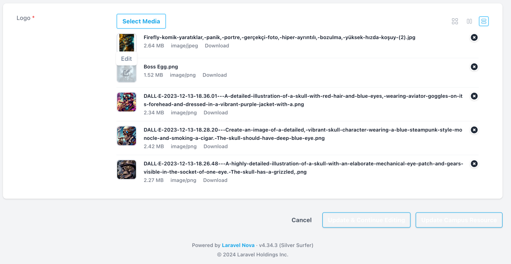
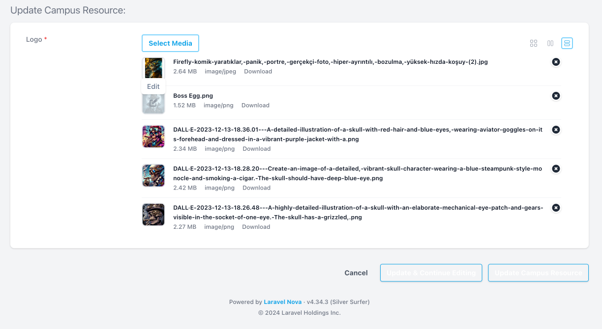
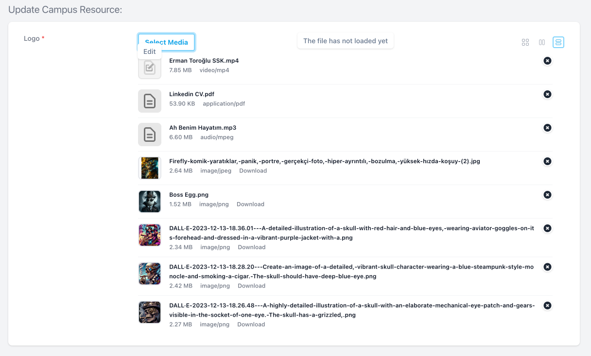

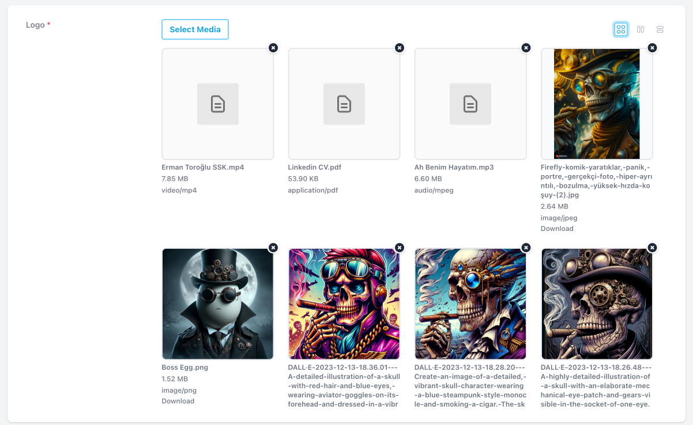

